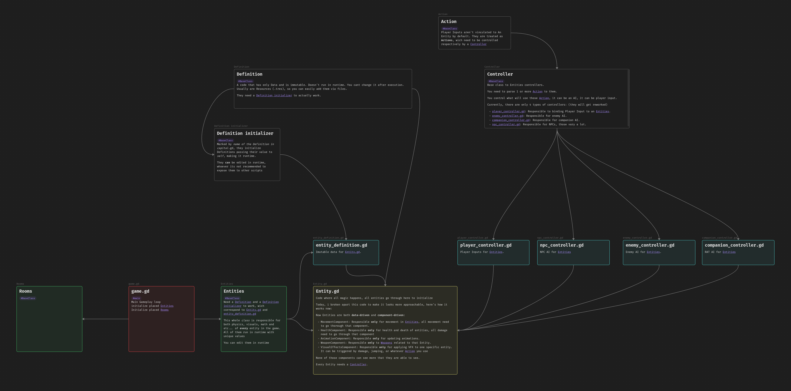

Early Build of Artificial Fighter (sequel of Carbonic Runner)

Rogue-like game with 2.5D look
(we are evolving)

GAMEPLAY STEPS TO FIRST REVEAL:

- [x] Entity
- [x] Player
- [x] Companion
- [x] Enemy
- [x] Weapons/Projectiles
- [x] Level Generation
- [x] Pathfinding
- [x] Combat
- [x] Inventory
- [x] Drop
- [x] Items
- [x] Cards
- [x] Buffs
- [ ] Tutorial
- [x] Optimizations
- [ ] Organization
- [ ] Save system
- [ ] Multiplayer
- [ ] Cross platform (maybe)

